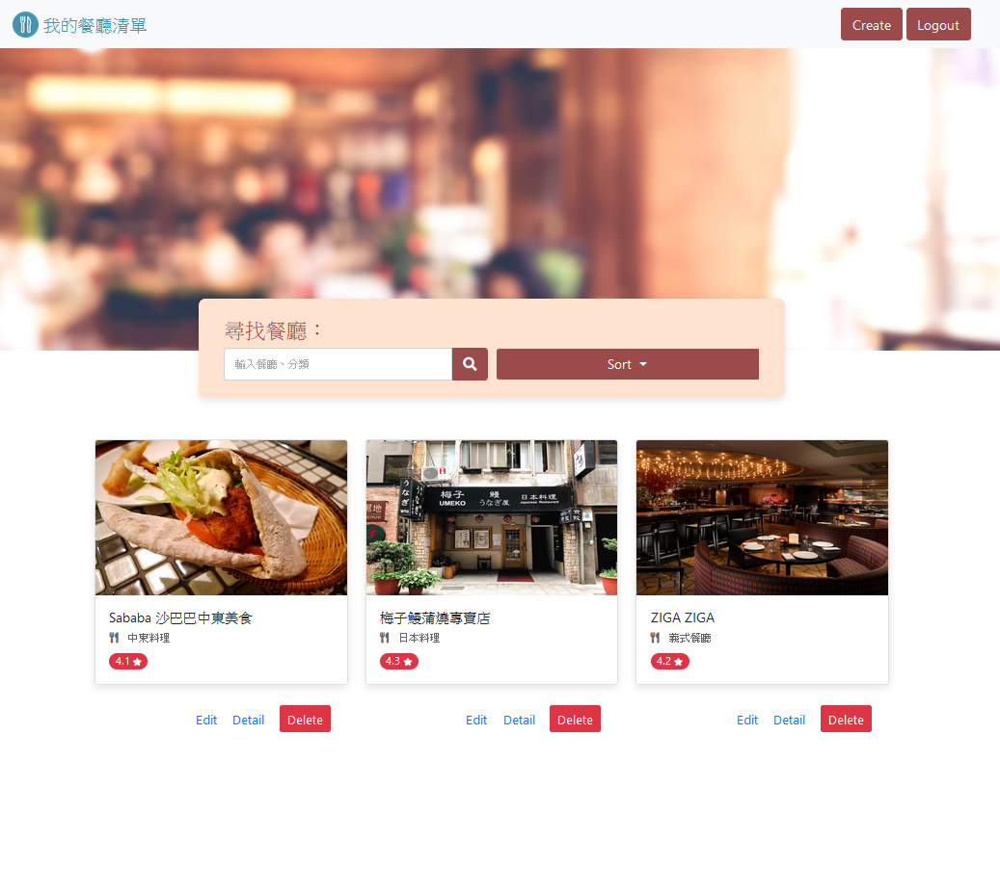
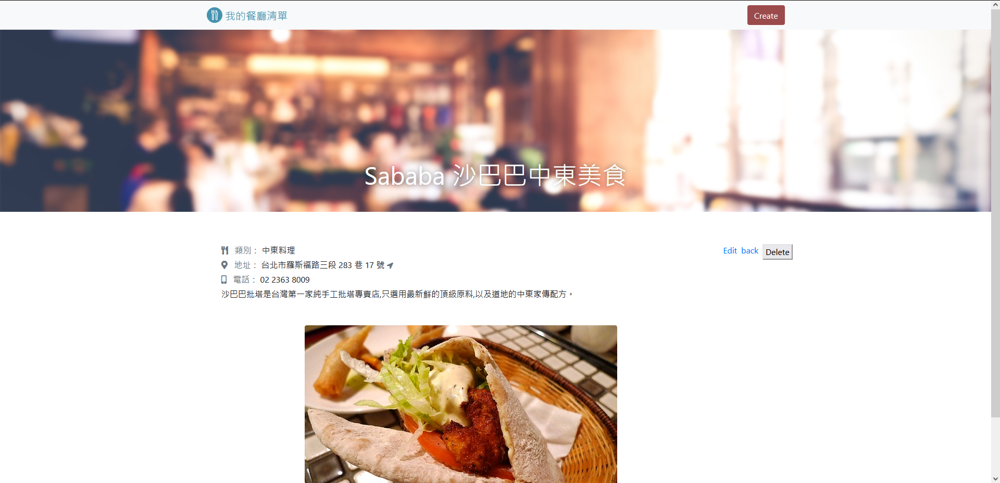

# Restaurant List

Restaurant List is a website built with Node.js and Express for users to look for the restaurants they want.




[中文README](README.zh_TW.md)

## Features

* Check all the restaurants available
* Show detail information of the restaurant
* Gain access to the restaurant through Google map
* Search for specific restaurants by category or name

## Installation and Execution

1. Install Node.js and npm
2. Clone the repository to your local machine
3. Open the repository in your local machine through the Terminal, and run

   ```bash
   npm install
   ```

4. After the installation, run

   ```bash
   npm run start
   ```

5. If you see the message below, it means that Restaurant List works correctly.

   ```bash
   Express is listening on http://localhost:3000
   ```

6. Press ctrl + C to stop the execution


## Technologies

* Node.js 14.16.0
* Express 4.17.1
* Express-Handlebars 3.0.0
* Bootstrap 4.2.1