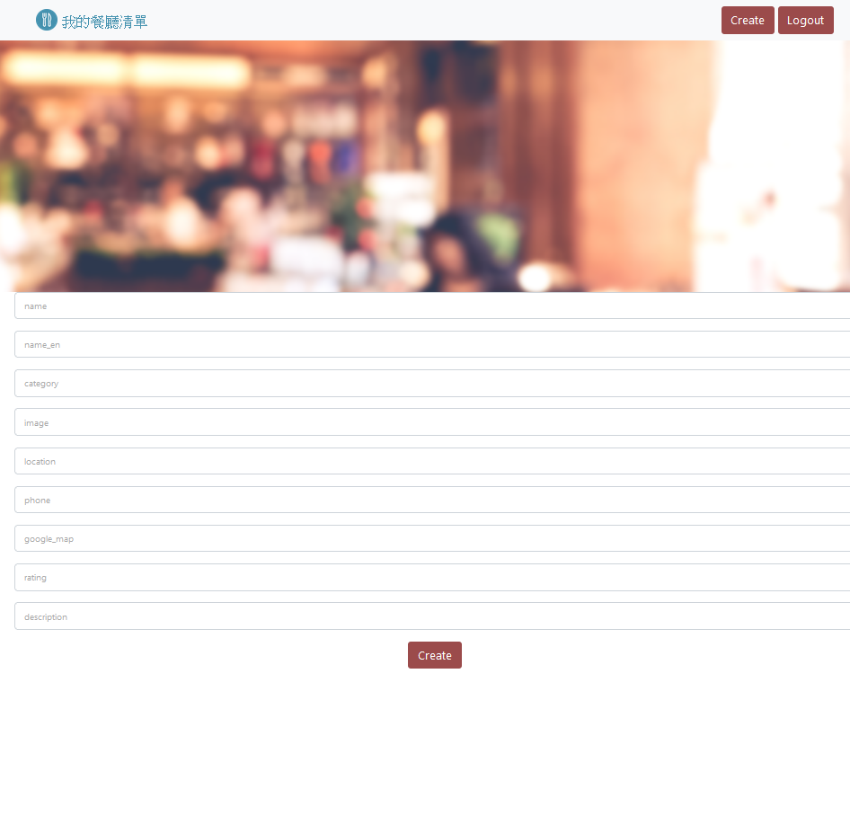

# Restaurant List

Restaurant List is a website built with Node.js and Express for users to keep their favorite restaurants. Users should register their accounts (by local or login through Facebook) to store the information of restaurants.

## Login Page

## Register Page

## Index Page

## Detail Page

## Create Page

## Edit Page


[中文README](README.zh_TW.md)

## Features

* Register and login through Facebook social login
* See all the restaurants in the list at a glance
* Add restaurant to the list
* Delete a restaurant from the list
* Show detail information of a restaurant
* Edit detail information of a restaurant
* Gain access to the restaurant through Google map
* Search for specific restaurants by category or name

## Installation and Execution

1. Install Node.js, npm, and MongoDB
2. Clone the repository to your local machine
3. Open the repository in your local machine through the Terminal, and run

   ```bash
   npm install
   ```
4. Open your MongoDB server, create a database called restaurant-list, generate seed data by running

   ```bash
   npm run seed
   ```

5. After generating seed data, run

   ```bash
   npm run start
   ```

6. If you see the message below, it means that Restaurant List works correctly.

   ```bash
   Express is listening on http://localhost:3000
   mongodb connected!
   ```

7. Press ctrl + C to stop the execution

## Test Data
* Account
  * email_1: user1@example.com
  * email_2: user2@example.com
  * password: 12345678

## Technologies

* Node.js 14.16.0
* Express 4.17.1
* Express-Handlebars 4.0.2
* MongoDB
* Mongoose 6.0.14
* bcryptjs 2.4.3
* connect-flash 0.1.1
* dotenv 10.0.0
* passport 0.5.2
* passport-facebook 3.0.0
* passport-local 1.0.0
* Bootstrap 4.2.1
* Font-awesome Latest 5.x